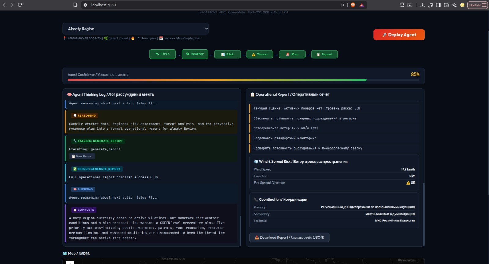
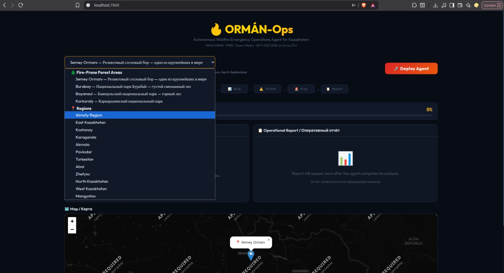

cd ~/my-projects/orman-ops
cat > README.md << 'EOF'
---
title: ORMÁN-Ops
colorFrom: red
colorTo: yellow
sdk: docker
app_port: 7860
pinned: true
license: mit
short_description: Autonomous Wildfire Emergency Operations Agent for Kazakhstan
---

# ORMÁN-Ops: Wildfire Emergency Operations Agent

An autonomous LLM-based agent for wildfire threat assessment and emergency response planning in Kazakhstan.

## What It Does

ORMÁN-Ops takes a Kazakhstan region as input and independently:

1. Fetches live satellite fire data from NASA FIRMS (VIIRS sensors)
2. Checks real-time weather conditions (Open-Meteo — wind, temperature, humidity)
3. Assesses regional fire risk (vegetation, historical data, seasonal factors)
4. Analyzes threat level with confidence scoring
5. Plans emergency or preventive response, adapting to what it finds
6. Generates a structured bilingual operational report (English / Russian)

The agent uses chain-of-thought reasoning, so every decision is visible. It adapts its strategy based on findings: if fires are detected it plans emergency response; if not, it assesses preventive readiness.

A full region assessment completes in roughly 60 seconds across six tool calls.

## Coverage

Four major fire-prone forest areas (Semey Ormanı, Burabay, Bayanaul, Karkaraly) and thirteen administrative regions of Kazakhstan.

## Architecture